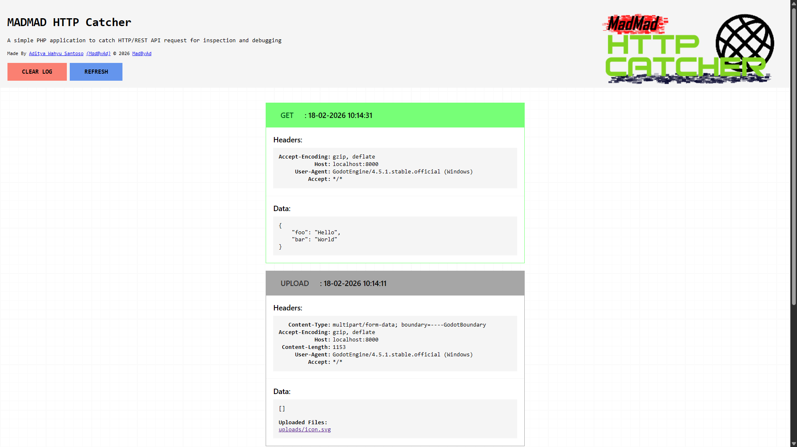

# HTTP Catcher


HTTP Catcher is a simple and small PHP application designed to catch HTTP/REST API request for inspection and debugging. It was created by me for helping mysefl inspecting HTTP request that was sended from Godot HTTPRequest Node but it can also be used for catching HTTP Request from other sources

The program is very lightweight, very small, and very easy to use! although make sure you have PHP installed. To use it, just type in the terminal:

```
php -S localhost:8080
```

and then on your browser just open localhost:8080 to access the dashboard, there you can view all the catched HTTP request that was sended to host or localhost:8080

## Preview

Here is what it looked like if you curious



## Features

This PHP app can catch all RESTFULL API request (GET, POST, PUT, PATCH, DELETE) and also file uploads as well in case you wanna test out file uploads. It can receive request in a form of HTML form body (application/x-www-form-urlencoded) or JSON data body (application/json)

The UI of this app can also be customized if you wanted too as well. Just modify the [dashboard.html](./dashboard.html) to modify the base dashboard of the app and modify the [log_template.html](./log_template.html) to modify how the log data appear
